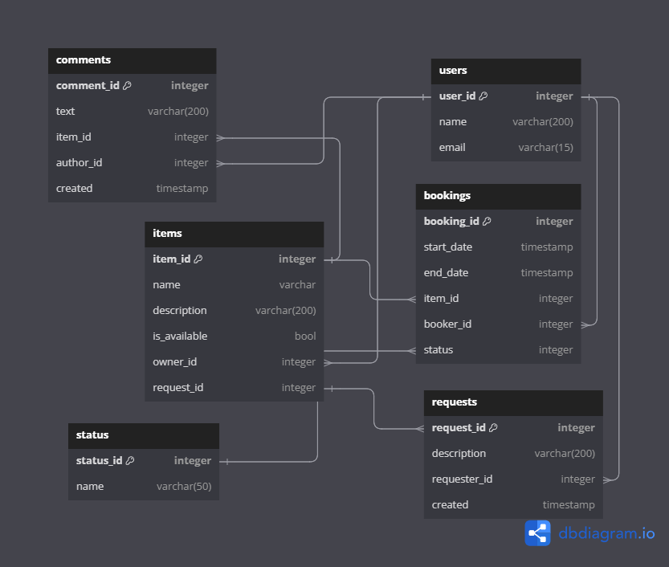

# Проект `BookingIt`
### Проект, созданный в рамках изучения Spring Data JPA, Docker, Hibernate, Mock и Spring Boot тестирования
### Service database

## Идея проекта
Заключается в создании приложения для возможности регистрации пользователей, создания заявок на временное
пользование вещами, которые могут добавить пользователи. Так же, в проекте есть возможность оставлять заявки на использование
той или иной вещи, добавленной пользователем. В проекте задействованы две базы данных: PostgreSQL (основная), H2 (для тестирования
работоспособности приложения).

## Развёртывание проекта

## Стек проекта
Spring, PostgreSQL, Hibernate, H2, SLF4J, Lombok, Spring Data JPA, Docker и Mock.
